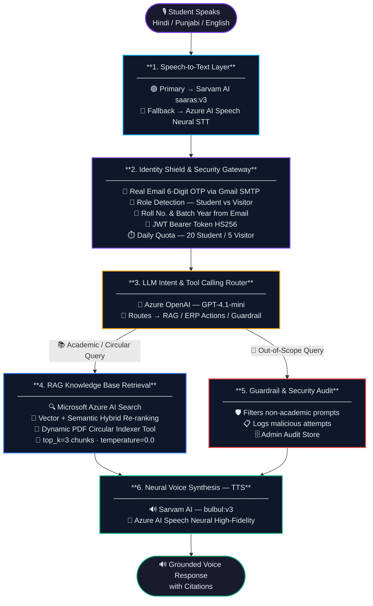

<div align="center">

<p align="center">
  
  &nbsp;&nbsp;&nbsp;&nbsp;
  
  &nbsp;&nbsp;&nbsp;&nbsp;
  
</p>

# 🎙️ UniVoice — Multilingual AI University Assistant

### Enterprise-Grade Voice & RAG Knowledge Gateway · Chitkara University

[](#)
[](#)
[](#)
[](#)
[](#)
[](#)

</div>

---

## 📖 Table of Contents

1. [Overview & Problem Statement](#-overview--problem-statement)
2. [System Architecture](#-system-architecture)
3. [Features](#-features)
4. [Admin Dashboard](#-admin-dashboard)
5. [Tech Stack](#-tech-stack)
6. [Project Structure](#-project-structure)
7. [Setup & Installation](#-setup--installation)
8. [Environment Configuration](#-environment-configuration)
9. [API Reference](#-api-reference)
10. [Engineering Team](#-engineering-team)

---

## 🎯 Overview & Problem Statement

Universities publish thousands of critical updates — exam rules, fee deadlines, hostel policies, attendance ordinances — scattered across PDFs and static portals. Students waste hours searching, often get wrong answers from general-purpose AI, and can't interact in their native language.

**UniVoice** solves this through a voice-first, multilingual RAG (Retrieval-Augmented Generation) assistant that:

- Understands **11 Indian languages** (Hindi, Punjabi, Tamil, Telugu, Bengali, Marathi, Gujarati, Kannada, Malayalam, Odia, English)
- Retrieves grounded answers from **official university PDFs** indexed in Azure AI Search
- Never hallucinates — every number, date, and rule is **copied verbatim from source documents**
- Protects against credit abuse with **Email OTP + JWT + daily quota enforcement**

---

## 🏗️ System Architecture



---

## 🚀 Features

### 🎙️ Voice Assistant (Student)
- **11 Indian Languages** — speaks back in the exact language the student used
- **Voice + Text modes** — mic recording with auto-stop at 10s, text input fallback
- **Provider selection** — choose between Sarvam AI (female Indian voice) or Azure Neural TTS (male voice)
- **Live quota display** — shows remaining daily queries in real time
- **Citations** — every answer links back to the source PDF clause
- **Audio visualizer** — animated waveform while the assistant speaks

### 🔐 Identity & Security
- **Real Email OTP** — 6-digit code dispatched via Gmail SMTP, expires in 5 minutes
- **Role detection** — `@chitkara.edu.in` emails → Student (20 queries/day), others → Visitor (5/day)
- **Student metadata extraction** — roll number, branch, and batch year parsed from email prefix
- **JWT (HS256, 72-hour expiry)** — all voice endpoints require Bearer token
- **Malicious query flagging** — out-of-scope attempts are logged and flagged per user

### 📚 RAG Knowledge Base
- **Azure AI Search** — hybrid vector + keyword retrieval over uploaded university PDFs
- **`text-embedding-3-small`** embeddings generated at index time for semantic search
- **Anti-hallucination** — `temperature: 0.0`, verbatim-copy rule enforced in system prompt
- **top_k=3 chunks** — retrieves 3 context chunks per query for full coverage
- **Admin PDF upload** — any PDF uploaded via admin panel is chunked, embedded, and indexed immediately
- **PDF delete** — removes file from disk + deletes all chunks from Azure AI Search by `source_file` filter
- **Retrieval logging** — every chunk retrieved is logged with score and preview for debugging

### 🛡️ Guardrail System
- **LLM-based intent routing** — GPT-4.1-mini classifies every query as in-scope / out-of-scope
- **5 structured tools** — university overview, library lookup, faculty contact, fee deadlines, ordinances RAG
- **Multilingual guardrail responses** — polite redirects in all 11 supported languages
- **No out-of-scope data leakage** — general knowledge, weather, movies are blocked

---

## 📊 Admin Dashboard

A full-featured admin control center at `/#/admin` (default: `admin@gmail.com` / `admin123`):

| Section | What it shows |
|---|---|
| **KPI Cards** | Total queries, today's queries, Sarvam calls, Azure Speech, OpenAI, Search calls — all live |
| **AI Operations Center** | Today's metrics: query count, avg response latency, RAG grounded %, out-of-scope count, per-service usage bars |
| **Tool Distribution** | Interactive donut chart — hover any segment to inspect query count + percentage |
| **7-Day Trend** | Line chart of daily query volume |
| **Live Service Health** | Real-time HTTP ping to all 4 AI services (Sarvam, Azure OpenAI, Azure Search, Azure Speech) |
| **Date-wise Breakdown** | Full table + multi-line chart · FROM/TO date picker to filter any range |
| **PDF Knowledge Base** | Lists all uploaded PDFs with size, date, indexed status · Upload + Delete buttons |
| **Language Analytics** | Per-language query count, share %, usage bar, avg response latency with colour coding |
| **Users & Audit** | Searchable/filterable user table · shows roll number, quota, today/total queries, malicious flags |

All data is live from telemetry — zero hardcoded values. Auto-refreshes every 30 seconds.

---

## 🛠️ Tech Stack

| Layer | Service / Model | Role |
|---|---|---|
| **LLM Reasoning** | Azure OpenAI `gpt-4.1-mini` | Intent routing, multilingual response generation |
| **Vector Search** | Azure AI Search | Hybrid vector + keyword RAG over PDFs |
| **Embeddings** | `text-embedding-3-small` | Chunk embedding at index time |
| **STT (Primary)** | Sarvam AI `saaras:v3` | Indian language speech transcription |
| **TTS (Primary)** | Sarvam AI `bulbul:v3` | Indian language neural voice synthesis |
| **STT/TTS (Fallback)** | Azure AI Speech Neural | High-fidelity fallback voice engine |
| **Email OTP** | Gmail SMTP | Real-time OTP security emails |
| **Backend** | FastAPI + Python 3.10+ (Asyncio) | REST API, quota, telemetry, JWT |
| **Frontend** | React 18 + Vite | Dark glassmorphism UI, no external CSS framework |
| **PDF Processing** | PyMuPDF (fitz) | Text extraction and 500-word overlapping chunking |

---

## 📁 Project Structure

```
Azure-VoiceAgent/
│
├── backend/                              # Python FastAPI — AI & API layer
│   ├── app/
│   │   ├── config.py                     # Settings, language mappings, quota config
│   │   ├── telemetry.py                  # In-memory + disk telemetry store
│   │   ├── main.py                       # FastAPI app, CORS, router registration
│   │   ├── routers/
│   │   │   ├── admin.py                  # All admin endpoints (stats, health, PDF, users)
│   │   │   ├── auth.py                   # OTP, verify, login, JWT, /me
│   │   │   ├── chat.py                   # /message and /voice endpoints
│   │   │   ├── voice.py                  # Standalone STT/TTS test endpoints
│   │   │   ├── tools.py                  # Tool inspection endpoints
│   │   │   └── documents.py              # Document management
│   │   ├── services/
│   │   │   ├── agent_service.py          # Core pipeline orchestrator
│   │   │   ├── azure_openai_service.py   # GPT-4.1-mini · temperature=0.0 · anti-hallucination prompt
│   │   │   ├── azure_speech_service.py   # Azure Neural STT + TTS
│   │   │   ├── sarvam_service.py         # Sarvam saaras:v3 STT + bulbul:v3 TTS
│   │   │   ├── rag_service.py            # Azure AI Search · top_k=3 · retrieval logging
│   │   │   ├── rag_ingestion.py          # Embedding generation helper
│   │   │   ├── pdf_indexer.py            # PDF → chunks → embeddings → Azure Search
│   │   │   ├── llm_router.py             # Intent classification (in-scope / tool selection)
│   │   │   ├── intent_guardrail.py       # Out-of-scope keyword filter + multilingual responses
│   │   │   ├── email_service.py          # Gmail SMTP OTP dispatch
│   │   │   └── user_service.py           # Users, OTP lifecycle, JWT, quota, audit trail
│   │   ├── tools/
│   │   │   ├── university_tools.py       # 4 structured tools (library, faculty, fees, overview)
│   │   │   ├── mock_db.py                # In-memory data for 4 tools
│   │   │   └── setup_azure_search.py     # Index creation helper
│   │   └── data/
│   │       ├── university_rulebook.py    # 6 local ordinance documents (fallback RAG)
│   │       ├── users.json                # Registered users store
│   │       └── audit_logs.json           # Audit trail store
│   ├── uploads/                          # Admin-uploaded PDFs (gitignored)
│   ├── run.py                            # Server entry point (port 8000)
│   ├── requirements.txt                  # Python dependencies
│   └── .env.example                      # Environment variable template
│
├── frontend/                             # React 18 + Vite — UI
│   ├── public/
│   │   ├── univoice-logo.svg
│   │   ├── azure-logo.svg
│   │   ├── sarvam-logo.svg
│   │   └── favicon.svg
│   ├── src/
│   │   ├── components/
│   │   │   ├── assistant/
│   │   │   │   ├── VoiceController.jsx   # Mic, text input, provider modal, quota display
│   │   │   │   ├── ConversationFeed.jsx  # Chat history with citations
│   │   │   │   ├── CitationDrawer.jsx    # Source document drawer
│   │   │   │   ├── AudioVisualizer.jsx   # Animated waveform
│   │   │   │   └── ErrorFallbackSimulator.jsx
│   │   │   ├── common/
│   │   │   │   ├── AuthModal.jsx         # OTP + Login flow modal
│   │   │   │   └── Badge.jsx
│   │   │   └── layout/
│   │   │       ├── Navbar.jsx            # Nav pills + user badge + Sign In (no dropdowns)
│   │   │       └── Footer.jsx
│   │   ├── pages/
│   │   │   ├── AdminPage.jsx             # Full admin dashboard (donut chart, date picker, AI ops)
│   │   │   ├── AssistantPage.jsx         # Voice assistant interface
│   │   │   ├── AboutPage.jsx             # Project overview
│   │   │   ├── ArchitecturePage.jsx      # Interactive architecture diagram
│   │   │   ├── TechnologyPage.jsx        # Azure + Sarvam AI stack showcase
│   │   │   └── SecurityPage.jsx          # RBAC simulator
│   │   ├── context/
│   │   │   └── AppContext.jsx            # Global state (auth, voice, route, quotas)
│   │   ├── data/
│   │   │   ├── architectureNodes.js
│   │   │   ├── azureServicesData.js
│   │   │   ├── indianLanguages.js        # 11 language definitions
│   │   │   ├── knowledgeDocuments.js
│   │   │   └── mockConversations.js
│   │   ├── index.css                     # Global design system · Jost font
│   │   └── App.jsx                       # Root router (5 pages, no Team page)
│   ├── index.html
│   ├── package.json
│   └── vite.config.js
│
└── README.md
```

---

## ⚡ Setup & Installation

### Prerequisites
- Node.js v18+
- Python 3.10, 3.11, or 3.12
- Active Microsoft Azure subscription (OpenAI + Search + Speech)
- Sarvam AI API key

### Backend

```bash
cd backend

# Create and activate virtual environment
python -m venv venv
.\venv\Scripts\activate        # Windows
# source venv/bin/activate     # Linux / macOS

# Install dependencies
pip install -r requirements.txt

# Add your credentials (copy .env.example → .env and fill in values)

# Start server
python run.py
# → http://localhost:8000
# → Swagger docs at http://localhost:8000/docs
```

### Frontend

```bash
cd frontend
npm install
npm run dev
# → http://localhost:5173
```

---

## 🔑 Environment Configuration

Create `backend/.env` with the following keys:

```env
# ── Sarvam AI ──────────────────────────────────────
SARVAM_API_KEY=your_sarvam_api_key
SARVAM_STT_MODEL=saaras:v3
SARVAM_TTS_MODEL=bulbul:v3

# ── Azure OpenAI ────────────────────────────────────
AZURE_OPENAI_API_KEY=your_azure_openai_key
AZURE_OPENAI_ENDPOINT=https://your-resource.services.ai.azure.com
AZURE_OPENAI_DEPLOYMENT=gpt-4.1-mini

# ── Azure AI Search ─────────────────────────────────
AZURE_SEARCH_API_KEY=your_search_key
AZURE_SEARCH_ENDPOINT=https://your-search.search.windows.net
AZURE_SEARCH_INDEX_NAME=university-rulebook

# ── Azure AI Speech ─────────────────────────────────
AZURE_SPEECH_KEY=your_speech_key
AZURE_SPEECH_REGION=koreacentral

# ── Server ──────────────────────────────────────────
BACKEND_HOST=0.0.0.0
BACKEND_PORT=8000

# ── Email OTP (Gmail SMTP) ──────────────────────────
SMTP_USER=your_email@gmail.com
SMTP_PASSWORD=your_16_char_app_password
SMTP_HOST=smtp.gmail.com
SMTP_PORT=587
SMTP_FROM_EMAIL=your_email@gmail.com
SMTP_FROM_NAME=UniVoice Assistant

# ── JWT Auth & Quotas ───────────────────────────────
JWT_SECRET=your-secure-secret-key
JWT_ALGORITHM=HS256
JWT_EXPIRY_HOURS=72
STUDENT_DAILY_QUOTA=20
VISITOR_DAILY_QUOTA=5
```

> `.env` is in `.gitignore` and will never be committed.

---

## 📡 API Reference

| Method | Endpoint | Description | Auth |
|---|---|---|---|
| `POST` | `/api/auth/send-otp` | Send 6-digit OTP to email | Public |
| `POST` | `/api/auth/verify-otp` | Verify OTP, register user, return JWT | Public |
| `POST` | `/api/auth/login` | Email + password login | Public |
| `GET`  | `/api/auth/me` | Current user profile + quota | `Bearer JWT` |
| `POST` | `/api/chat/message` | Text query → RAG → TTS | `Bearer JWT` |
| `POST` | `/api/chat/voice` | Audio upload → STT → RAG → TTS | `Bearer JWT` |
| `POST` | `/api/admin/login` | Admin credentials → token | Public |
| `GET`  | `/api/admin/stats` | Full telemetry stats | `X-Admin-Token` |
| `GET`  | `/api/admin/service-health` | Live ping to all 4 AI services | `X-Admin-Token` |
| `GET`  | `/api/admin/daily-breakdown` | Per-day service call table | `X-Admin-Token` |
| `GET`  | `/api/admin/pdfs` | List all PDFs (from uploads/ folder) | `X-Admin-Token` |
| `POST` | `/api/admin/upload-pdf` | Upload + chunk + embed + index PDF | `X-Admin-Token` |
| `DELETE` | `/api/admin/pdfs/{filename}` | Delete PDF from disk + Azure Search | `X-Admin-Token` |
| `GET`  | `/api/admin/language-analytics` | Per-language query stats + avg latency | `X-Admin-Token` |
| `GET`  | `/api/admin/ai-operations` | Today's AI ops metrics (latency, grounded %) | `X-Admin-Token` |
| `GET`  | `/api/admin/users` | All registered users + audit data | `X-Admin-Token` |

---

## 👥 Engineering Team

**Department of Computer Science & Engineering · Chitkara University**
*Capstone Project — Azure Cloud AI · 2025–2026*

| Name | Role |
|---|---|
| **Raman Deep Bansal** | Lead AI & Cloud Architect |
| **Satyam Chhabra** | Full-Stack & Voice Integrator |
| **Sukritti Singla** | Knowledge & Data Engineer |
| **Simran** | Security & Cloud Engineer |

---

<div align="center">

**UniVoice** · Built on Microsoft Azure AI + Sarvam AI · Chitkara University Capstone 2025–26

</div>
